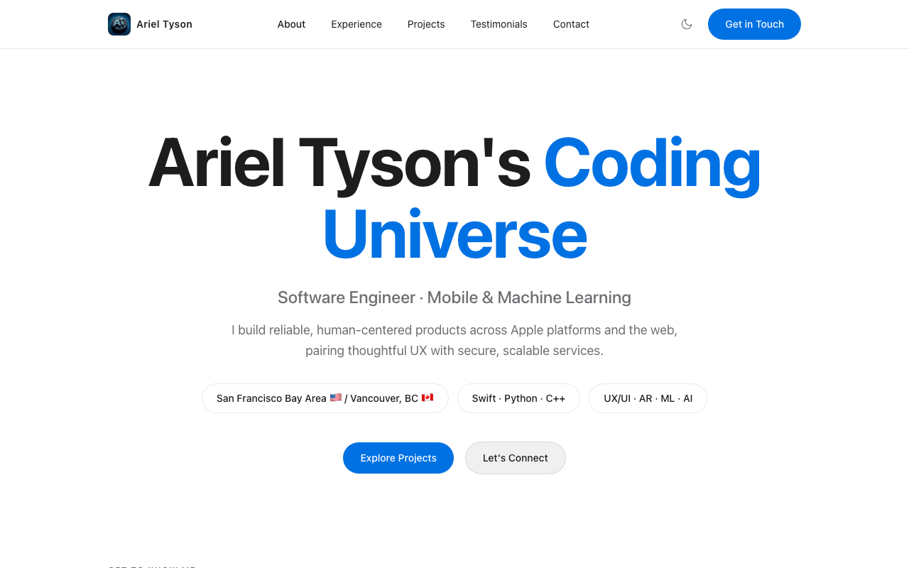
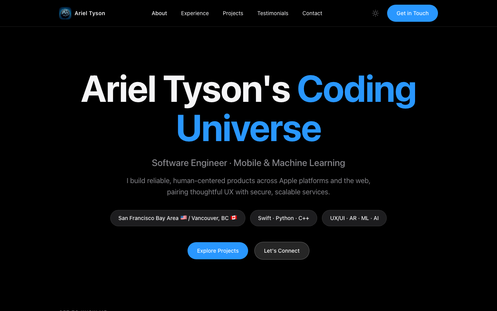

# Ariel Tyson's Coding Universe

A personal portfolio website built with React, TypeScript, and Tailwind CSS — designed around Apple's Human Interface Guidelines with full light/dark mode support and WCAG 2.2 AA accessibility compliance.

## Preview

**Light Mode**



**Dark Mode**



## Live Site

**[www.arieljtyson.com](https://www.arieljtyson.com)**

## Tech Stack

- **Framework:** React 18 + TypeScript
- **Styling:** Tailwind CSS 3 with CSS custom properties for theming
- **Animations:** Framer Motion with `prefers-reduced-motion` support
- **Build:** Vite
- **Deployment:** GitHub Actions → GitHub Pages
- **Design System:** Apple HIG-inspired — SF Pro font stack, semantic color tokens, Apple border radii

## Features

- **Light/Dark Mode** — class-based toggle with `localStorage` persistence and system preference detection
- **Interactive Cards** — CSS-only mouse-tracking glow effects and animated gradient borders
- **Responsive** — mobile-first layout with collapsible navigation
- **Accessible** — skip-to-content link, focus-visible outlines, ARIA labels, heading hierarchy, reduced motion support
- **Performant** — no heavy 3D libraries; all visual effects are pure CSS

## Sections

| Section | Description |
|---------|-------------|
| **Hero** | Bold headline with animated pills and glassy CTA |
| **About** | Introduction, service cards with glow effects, and tech toolbox |
| **Experience** | Career timeline — Apple, Twitch (Amazon), Workday, Microsoft TEALS, RAD Torque |
| **Projects** | Six featured projects with unique SVG illustrations |
| **Testimonials** | Quotes from colleagues and students |
| **Contact** | Email, GitHub, and LinkedIn with gradient card form |

## Featured Projects

- **Tourism Beats** — SwiftUI travel companion with MapKit, WeatherKit, and SceneKit
- **NanoRender Engine** — C++ rendering engine with ray marching and Metal GPU shaders
- **Focus AR** — Apple Swift Student Challenge winner with ARKit and CoreML
- **Enterprise Expense Tracker** — ASP.NET Core MVC portal with Syncfusion dashboards
- **AR Health** — AR wellness companion with heart-rate analytics and SceneKit
- **PomoDuo** — Synchronized Pomodoro timer for couples using Screen Time APIs and Firebase

## Development

```bash
npm install
npm run dev        # Start dev server on localhost:5173
npm run build      # Production build to dist/
```

## Deployment

Pushes to `main` trigger the GitHub Actions workflow (`.github/workflows/deploy.yml`) which builds with Vite and deploys to GitHub Pages with the custom domain `www.arieljtyson.com`.

## License

This project is licensed under the [MIT License](LICENSE).
